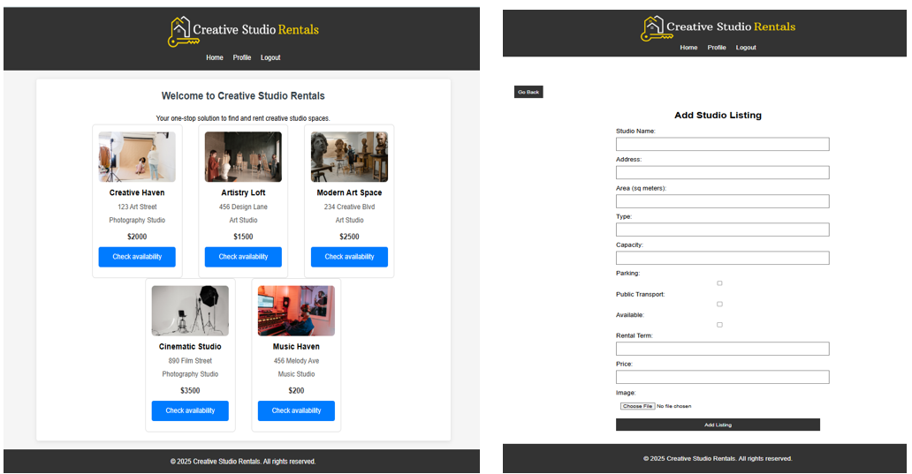
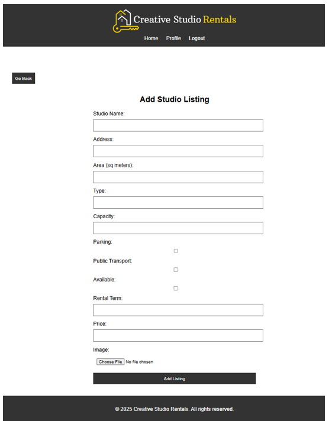

# Creative-Studio-Rentals

🎮LIVE DEMO:
https://studiorental-nodejs.onrender.com 

🖼️ Previeew Image

📄 Description
- A Node.js web application for managing creative studio rentals. Users can register, list, and browse studios, with full CRUD functionality built using Express and data stored in local JSON files.

✨ Features
- View all available creative studio listings
- Register users with different roles (Owner / Renter)
- Add, edit, and delete studio listings (Owner only)
- Update user profile and auto-sync linked listings
- Local JSON file-based data storage (no database)
- Fully deployed to Render (public demo available)
